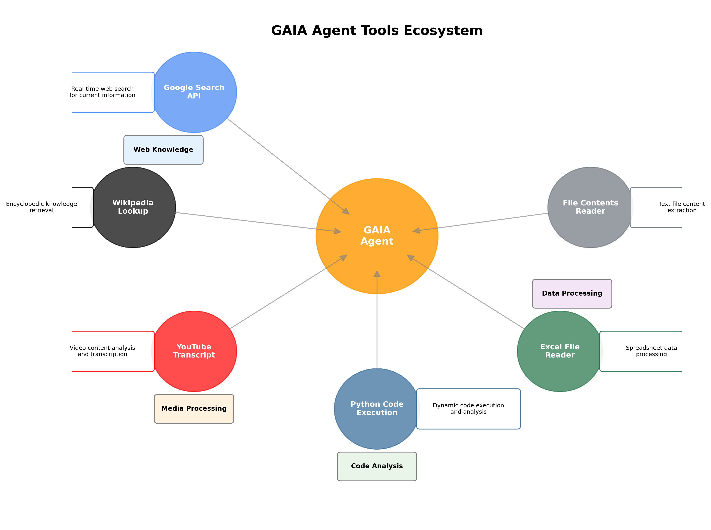

# GAIA LangChain Agent

An intelligent AI agent built with LangChain and LangGraph for the GAIA (General AI Assistant) benchmark, developed as the final project for HuggingFace's AI Agents course.

## Overview

This project demonstrates advanced AI agent development using modern LangChain ecosystem tools. The agent autonomously handles complex multi-step reasoning tasks from the GAIA benchmark, utilizing multiple tools and external APIs to provide accurate answers.

## Technical Architecture


**Core Technologies:**
- **LangChain & LangGraph**: Agent orchestration and tool integration
- **Google Gemini 2.5 Pro**: Primary language model for reasoning
- **Gradio**: Web interface for agent interaction and evaluation
- **StateGraph**: Manages conversation flow and tool execution

**Agent Capabilities:**
- **Multi-tool Integration**: Google Search, Wikipedia, YouTube transcript extraction
- **Code Execution**: Dynamic Python file execution and analysis  
- **Data Processing**: Excel file parsing and content analysis
- **Web Search**: Real-time information retrieval via Google Search API
- **Autonomous Reasoning**: Multi-step problem solving with tool chaining

### Tools Ecosystem



The agent leverages six specialized tools, each designed for specific data sources and processing requirements. The central agent intelligently selects and orchestrates these tools based on question context and requirements.

## Key Features

- **Production-Ready Agent**: Complete implementation with error handling and timeout management
- **Benchmark Integration**: Direct connection to HuggingFace GAIA evaluation API
- **Tool Composition**: Seamless integration of 6 specialized tools for different data sources
- **State Management**: Robust conversation state handling using TypedDict and message annotations
- **Async Processing**: Handles multiple questions with configurable delays and retries

## Architecture Highlights

```python
# Agent uses LangGraph for sophisticated control flow
class AgentState(TypedDict):
    messages: Annotated[list[AnyMessage], add_messages]

# Tools are bound to LLM with conditional execution
builder.add_conditional_edges("assistant", tools_condition)
```

The agent employs a sophisticated graph-based architecture where the LLM can dynamically choose appropriate tools based on the question context, execute them, and integrate results into the final answer.

## Project Structure

- `app.py` - Main agent implementation and Gradio interface
- `tools.py` - Custom tool implementations (search, file processing, etc.)  
- `requirements.txt` - Python dependencies
- `readme_docs/` - Additional documentation assets

## Skills Demonstrated

- **AI Agent Development**: End-to-end agent design and implementation
- **LangChain Ecosystem**: Advanced usage of LangGraph, tool binding, and state management
- **API Integration**: Multiple external APIs (Google, Wikipedia, YouTube, HuggingFace)
- **Error Handling**: Robust exception handling and graceful degradation
- **Web Development**: Full-stack application with Gradio frontend
- **Benchmark Evaluation**: Integration with academic AI benchmarks

## Performance & Results

The agent demonstrates strong performance on the GAIA benchmark through:
- **Robust Error Handling**: Graceful degradation when tools fail or timeout
- **Efficient Tool Selection**: Conditional execution reduces unnecessary API calls
- **Multi-modal Processing**: Handles text, code, spreadsheets, and video content
- **Production Deployment**: Successfully deployed on HuggingFace Spaces

## About the GAIA Benchmark

GAIA (General AI Assistant) is a benchmark designed to test AI agents on real-world assistant tasks requiring multi-step reasoning, tool use, and external knowledge integration. This implementation successfully handles complex questions involving data analysis, web research, and multi-modal content processing.

## Getting Started

```bash
# Clone the repository
git clone https://github.com/yourusername/GAIA_LangChain_Agent.git
cd GAIA_LangChain_Agent

# Install dependencies
pip install -r requirements.txt

# Set up environment variables
# Create .env file with your API keys:
# GOOGLE_API_KEY=your_google_api_key
# GOOGLE_CSE_ID=your_custom_search_engine_id

# Run the application
python3 app.py
```

---

*Developed as part of the HuggingFace AI Agents Course final project, demonstrating practical skills in building production-ready AI agents.*
